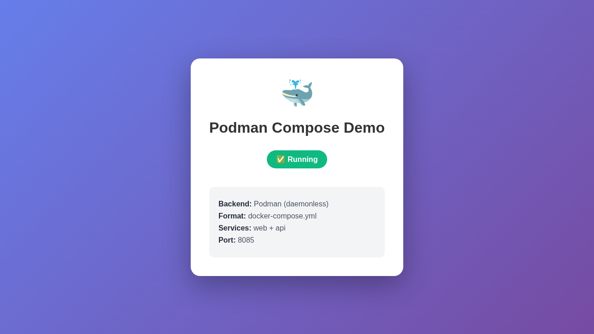

# 07 - Podman Compose

`podman-compose` を使って docker-compose.yml 形式で複数コンテナを管理する例です。

## 学べること

- `podman-compose` のインストール
- docker-compose.yml の書き方
- 複数コンテナの一括管理
- カスタム HTML のマウント

## 前提条件

```bash
# podman-compose のインストール
sudo apt install -y podman-compose

# または pip で
pip install podman-compose

# バージョン確認
podman-compose --version
```

## ファイル構成

```
07-compose-example/
├── README.md          # このファイル
├── docker-compose.yml # Compose ファイル
├── .env               # 環境変数
├── html/              # カスタム HTML
│   └── index.html
├── run.sh             # 実行スクリプト
├── cleanup.sh         # クリーンアップ
└── screenshot.png     # スクリーンショット
```

## 実行方法

### 起動

```bash
# バックグラウンドで起動
podman-compose up -d
```

### スクリーンショット



### 操作

```bash
# ログ確認
podman-compose logs

# 特定サービスのログ
podman-compose logs web

# ステータス確認
podman-compose ps

# 再起動
podman-compose restart

# 停止
podman-compose down

# 停止＋ボリューム削除
podman-compose down -v
```

## Docker Compose との違い

| 項目 | Docker Compose | Podman Compose |
|------|----------------|----------------|
| バックエンド | Docker daemon | Podman (daemonless) |
| rootless | 要設定 | デフォルト |
| Pod 対応 | なし | Pod として実行可能 |

## Pod として実行

```bash
# Pod モードで起動
podman-compose --pod up -d
```

## 動作確認

```bash
# 起動
$ podman-compose up -d

# ステータス確認
$ podman ps
CONTAINER ID  IMAGE                           COMMAND               STATUS        PORTS                 NAMES
035df3aabc    docker.io/library/nginx:alpine  nginx -g daemon o...  Up 5 seconds   0.0.0.0:8085->80/tcp  07-compose-example_web_1
df669670d8    docker.io/library/nginx:alpine  nginx -g daemon o...  Up 5 seconds   0.0.0.0:8086->80/tcp  07-compose-example_api_1

# Web にアクセス
$ curl http://localhost:8085
<!DOCTYPE html>
<html lang="ja">
<head>
    <title>Podman Compose Demo</title>
...

# API にアクセス (nginx デフォルト)
$ curl http://localhost:8086
<!DOCTYPE html>
...
```

## クリーンアップ

```bash
./cleanup.sh
```
